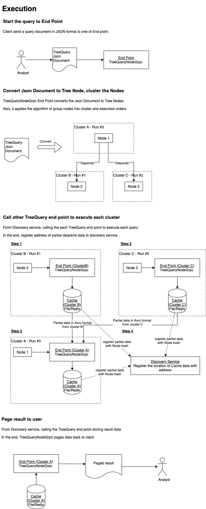
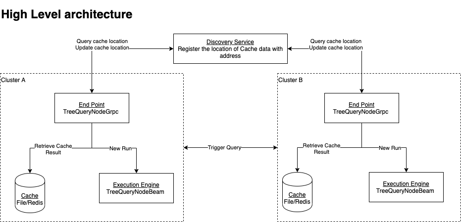
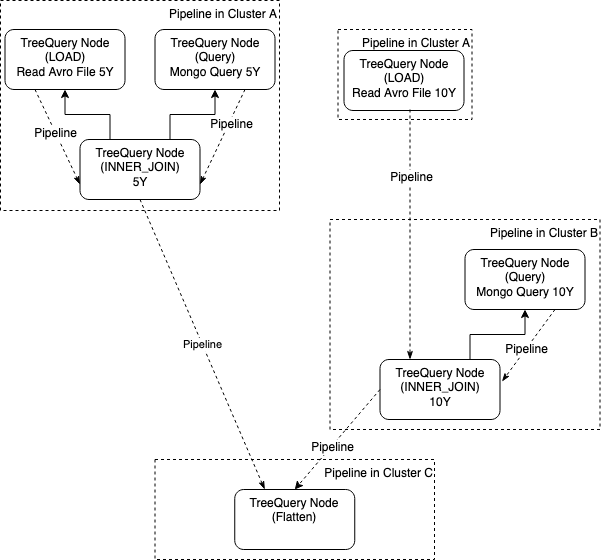

# System Design Document - Tree Query

## Our business problem
When working on Big Data analysis from data located in different locations/technology stacks, <br>
we would like to view the data automatically in one stop.

Concrete use cases <br>
Financial Institution analyzes trade data from different location.<br>
Some regulatory jurisdiction has a strict Data Privacy/Residency barrier <br>
For example, China Cybersecurity Law, Indonesian OJK onshore rule, <br>
All trade activities can only stay onshore database. <br>
The analysis should be able to source and join trade data/static data from different database globally.

Therefore, we are seeking an effective distributed batch query to solve this problem.


## Objective
An asynchronous distributed batch query system distributes data query and joining of data from different source in n-ary tree compute nodes.<br>

Leaf node queries from different sources:<br>
1. Avro file
2. SQL
3. Mongo
4. Redis
5. Kafka (batch)
After leaf node finishing query, it return output as Avro entries into 
1. Avro Flat File (network folder/AWS S3/GCP Cloud Storage)
2. Redis (distributed MEM cache)
for parent node to process.

Parent node applies batch streaming framework such as Apache beam to join the data.
Each node output results into Avro Flat File/Redis for upper level of node calculation until reaching root node. 

In the end, client receives result from root node after all node computation finish.

## Execution explanation
Cluster A, B, C partially run the query in above JSON document. <br>
In the end, we page the final result back to client.<br>


## High level Architecture
High Level architecture <br>


## Algorithm
Simple Depth First Search of the tree.
Time Complexity : O(N)
Traverse each node for query and joining.

Space Complexity: O(kN), where k is the level of tree
Buffer storage of query result, intermediate join result.

## High Level Tree design


Each node is stateless with identical code. <br>
A json file describes the tree schema. <br>
The request to the root node carries this json file.<br>
Nodes run in different clusters representing different zones/regions.<br>
In the diagram, <br>
10Y analysis INNER JOIN, I/O running in cluster B.<br>
5Y analysis INNER JOIN, I/O running in cluster A.<br>
In the end, FLATTEN of 5Y and 10Y result running in cluster A

## Json file describing tree schema

```Json
{
  "name": "Flatten5Y10Ydata",
  "description": "Flatten 5Y+10Y data",
  "action": "FLATTEN",
  "cluster": "C",
  "children": [
    {
      "name": "Join5YData",
      "description": "Join 5Y data",
      "action": "INNER_JOIN",
      "cluster": "A",
      "children":[{
        "name": "Load5YBondTrade",
        "description": "Load BondTrades 5Y",
        "action": "LOAD",
        "cluster": "A",
        "source" : "gs://dexbigdata-bondtrade/bondtrade1.avro",
        "avro_schema": "{\"name\":\"BondTrade\",\"type\":\"record\",\"namespace\":\"io.exp.security.model.avro\",\"fields\":[{\"name\":\"id\",\"type\":\"string\"},{\"name\":\"cust\",\"type\":\"string\"},{\"name\":\"tradeDate\",\"type\":\"string\"},{\"name\":\"tradeType\",\"type\":\"string\"},{\"name\":\"timestamp\",\"type\":\"long\",\"logicalType\":\"time-millis\"},{\"name\":\"asset\",\"type\":{\"name\":\"Asset\",\"type\":\"record\",\"fields\":[{\"name\":\"securityId\",\"type\":\"string\"},{\"name\":\"notional\",\"type\":\"double\"},{\"name\":\"price\",\"type\":\"double\"},{\"name\":\"currency\",\"type\":\"string\"},{\"name\":\"bidask\",\"type\":{\"name\":\"BidAsk\",\"type\":\"enum\",\"symbols\":[\"BID\",\"ASK\"]}}]}}]}"
      },
        {
          "name": "Load5YMongoStatic",
          "description": "Query Mongo Static 5Y",
          "action": "QUERY",
          "cluster": "A",
          "queryType" : "MONGO",
          "source" : "localmongo",
          "database" : "hkma",
          "collection": "OutstandingGovBond",
          "query" : "{}",
          "avro_schema": "{\"name\":\"BondStatic\",\"type\":\"record\",\"namespace\":\"io.exp.security.model.avro\",\"fields\":[{\"name\":\"expected_maturity_date\",\"type\":\"string\"},{\"name\":\"original_maturity\",\"type\":\"string\"},{\"name\":\"issue_number\",\"type\":\"string\"},{\"name\":\"isin_code\",\"type\":\"string\"},{\"name\":\"stock_code\",\"type\":\"string\"},{\"name\":\"coupon\",\"type\":\"double\"},{\"name\":\"outstanding_size\",\"type\":\"double\"},{\"name\":\"institutional_retail\",\"type\":\"string\"},{\"name\":\"fixfloat\",\"type\":{\"name\":\"FixFloat\",\"type\":\"enum\",\"symbols\":[\"FIX\",\"FLOAT\"]}}]}"
        }
      ],
      "keys": [ {"left":0, "right":1 ,"on":[{"left": "asset.securityId","right": "isin_code"}] ,
                "labels":  {"left":"bondtrade", "right":"bondstatic"}} ]
    },
    {
      "name": "Join10YData",
      "description": "Join 10Y data",
      "action": "INNER_JOIN",
      "cluster": "B",
      "children":[{
        "name": "Load10YBondTrade",
        "description": "Load BondTrades 10Y",
        "action": "LOAD",
        "cluster": "A",
        "source" : "gs://dexbigdata-bondtrade/bondtrade1.avro",
        "avro_schema": "{\"name\":\"BondTrade\",\"type\":\"record\",\"namespace\":\"io.exp.security.model.avro\",\"fields\":[{\"name\":\"id\",\"type\":\"string\"},{\"name\":\"cust\",\"type\":\"string\"},{\"name\":\"tradeDate\",\"type\":\"string\"},{\"name\":\"tradeType\",\"type\":\"string\"},{\"name\":\"timestamp\",\"type\":\"long\",\"logicalType\":\"time-millis\"},{\"name\":\"asset\",\"type\":{\"name\":\"Asset\",\"type\":\"record\",\"fields\":[{\"name\":\"securityId\",\"type\":\"string\"},{\"name\":\"notional\",\"type\":\"double\"},{\"name\":\"price\",\"type\":\"double\"},{\"name\":\"currency\",\"type\":\"string\"},{\"name\":\"bidask\",\"type\":{\"name\":\"BidAsk\",\"type\":\"enum\",\"symbols\":[\"BID\",\"ASK\"]}}]}}]}"
      },
        {
          "name": "Load10YMongoStatic",
          "description": "Query Mongo Static 10Y",
          "action": "QUERY",
          "cluster": "B",
          "queryType" : "MONGO",
          "source" : "localmongo",
          "database" : "hkma",
          "collection": "OutstandingGovBond",
          "query" : "{}",
          "avro_schema": "{\"name\":\"BondStatic\",\"type\":\"record\",\"namespace\":\"io.exp.security.model.avro\",\"fields\":[{\"name\":\"expected_maturity_date\",\"type\":\"string\"},{\"name\":\"original_maturity\",\"type\":\"string\"},{\"name\":\"issue_number\",\"type\":\"string\"},{\"name\":\"isin_code\",\"type\":\"string\"},{\"name\":\"stock_code\",\"type\":\"string\"},{\"name\":\"coupon\",\"type\":\"double\"},{\"name\":\"outstanding_size\",\"type\":\"double\"},{\"name\":\"institutional_retail\",\"type\":\"string\"},{\"name\":\"fixfloat\",\"type\":{\"name\":\"FixFloat\",\"type\":\"enum\",\"symbols\":[\"FIX\",\"FLOAT\"]}}]}"
        }
      ],
      "keys": [ {"left":0, "right":1 ,"on":[{"left": "asset.securityId","right": "isin_code"}],
                "labels":  {"left":"bondtrade", "right":"bondstatic"} } ]
    }
  ]
}

```
Here, entire tree run by three clusters: A, B, C <br>
A: INNER_JOIN 5Y, QUERY 5Y, LOAD 5Y, LOAD 10Y <br>
B: INNER_JOIN 10Y, QUERY 10Y <br>
C: FLATTEN <br>
INNER_JOIN 10Y in B has dependency of LOAD 10Y in A <br>
FLATTEN has dependency on both INNER_JOIN 5Y in A and INNER_JOIN 10Y in B <br>
Executor analyze the action plan of dependency. <br>
Such that, calculation without ANY dependency running first, <br>
LOAD 10Y , INNER_JOIN 5Y running first <br>
-> <br>
INNER_JOIN 10Y <br>
-> <br>
Finally, FLATTEN run last


### Algorithm: Cluster dependency graph
The cluster dependency graph detection added into Depth First Search.

Starting from root node, we register the first Cluster A.
Then, it traverses down to child.
If Child Cluster <> parent cluster, 
register into Data Structure: Dict[Set[Node]] if ONE to MANY dependency
Dict[Node "INNER_JOIN"].add([Node LOAD])
Also cache Dict[Node] of the MANY to ONE dependency: (node child only have one parent!)
Dict[Node "LOAD" ] = Node "INNER_JOIN"

Create dependency map
Time complexity O(N)
Space complexity O(N)

Choose job to run
Search in ONE to MANY dependency for entry having zero sized set

Job finish and return
Remove from ONE to MANY dependency and Many to ONE dependency 
Time complexity O(1) to remove from ONE to MANY dependency and MANY to ONE dependency

Python code to illustrate the cluster construction: <br>
[Algorithm Cluster Construction in Python](PythonAlgorithm/cluster/TreeQueryCluster.py)

### Algorithm: Convert each cluster to workflow pipeline
####Definition: Pipeline creation from Cluster nodes
Convert cluster to Pipeline illustration. <br>


We create pipeline from cluster.
Cluster to pipeline order is a reverse order of dependency
Currently, the cluster conversion is a destructive process of cluster dependency map
1) find the list of clusters  having no dependency
2) convert clusterlists without dependency to each pipeline
3) for each cluster in clusterlists
3.1) Remove cluster from dependency map if dependency[cluster] is empty
3.2) Remove cluster from dependency map[dependent child cluster].remove(cluster)
4) go to (1) until cluster dependency is empty

For each cluster, we create pipeline from each subtree.

The Pipeline creation in each cluster is a reverse order read of the tree.
For any node, its child must be executed before.

Therefore, postorder traversal of the tree construct the pipeline beginning from children.

[Algorithm Cluster to Pipeline conversion in Python](PythonAlgorithm/cluster/TreeQueryExecute.py)

### Algorithm: Convert each cluster to workflow pipeline
####Definition: Pipeline 

### Note on Join
By now, we only support INNER Join of two data sources.


## Potential Usage
Big Query application sourcing data from different sources in different locations


