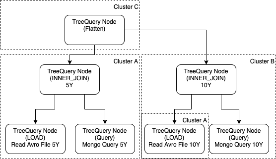

#System Design Document - Tree Query

##Objective
An asynchronous distributed batch query system distributes data query and joining of data from different source in n-ary tree compute nodes.<br>

Leaf node queries from different sources:<br>
1. Avro file
2. SQL
3. Mongo
4. Redis
5. Kafka (batch)
After leaf node finishing query, it return output as Avro entries into 
1. Avro Flat File (network folder/AWS S3/GCP Cloud Storage)
2. Redis (distributed MEM cache)
for parent node to process.

Parent node applies batch streaming framework such as Apache beam to join the data.
Each node output results into Avro Flat File/Redis for upper level of node calculation until reaching root node. 

In the end, client receives result from root node after all node computation finish.

##Algorithm
Simple Depth First Search of the tree.
Time Complexity : O(N)
Traverse each node for query and joining.

Space Complexity: O(kN), where k is the level of tree
Buffer storage of query result, intermediate join result.

##High Level architecture design



Each node is stateless with identical code. <br>
A json file describes the tree schema. <br>
The request to the root node carries this json file.<br>
Nodes run in different clusters representing different zones/regions.<br>
In the diagram, <br>
10Y analysis INNER JOIN, I/O running in cluster B.<br>
5Y analysis INNER JOIN, I/O running in cluster A.<br>
In the end, FLATTEN of 5Y and 10Y result running in cluster A

##Json file describing tree schema

```Json

{
  "description": "Flatten Query of both 5Y and 10Y bond trade result",
  "action": "FLATTEN",
  "cluster": "A",
  "children": [
    {
      "description": "Joinning bond trades and Bond security set with 5Y tenor",
      "action": "INNER_JOIN",
      "cluster": "A",
       "children":[{
            "description": "Load Bond Trades",
            "action": "LOAD",
            "cluster": "B",
            "source" : "gs://dexbigdata-bondtrade/bondtrade1.avro",
            "avro_schema": {"name":"BondTrade","type":"record","namespace":"io.exp.security.model.avro","fields":[{"name":"id","type":"string"},{"name":"cust","type":"string"},{"name":"tradeDate","type":"string"},{"name":"tradeType","type":"string"},{"name":"timestamp","type":"long","logicalType":"time-millis"},{"name":"asset","type":{"name":"Asset","type":"record","fields":[{"name":"securityId","type":"string"},{"name":"notional","type":"double"},{"name":"price","type":"double"},{"name":"currency","type":"string"},{"name":"bidask","type":{"name":"BidAsk","type":"enum","symbols":["BID","ASK"]}}]}}]}
          },
          {
            "description": "Query Mongo Security",
            "action": "QUERY",:
            "cluster": "A",
            "queryType" : "MONGO",
            "source" : "localmongo",
            "database" : "hkma",
            "collection": "OutstandingGovBond",
            "query" : "{}",
            "avro_schema": {"name":"BondStatic","type":"record","namespace":"io.exp.security.model.avro","fields":[{"name":"expected_maturity_date","type":"string"},{"name":"original_maturity","type":"string"},{"name":"issue_number","type":"string"},{"name":"isin_code","type":"string"},{"name":"stock_code","type":"string"},{"name":"coupon","type":"double"},{"name":"outstanding_size","type":"double"},{"name":"institutional_retail","type":"string"},{"name":"fixfloat","type":{"name":"FixFloat","type":"enum","symbols":["FIX","FLOAT"]}}]}
          }
      ],
      "keys": [{"0": "asset.securityId","1": "isin_code"}]
    }
  ]
}

```
Here, entire tree run by two clusters: A, B
A: Flatten, INNER_JOIN, QUERY
B: LOAD
A has dependency of B
Executor analyze the action plan of dependency.
Such that, B run first in cluster B.
After cluster B finish and return result,
cluster A triggers to finish the final calculation.

### Algorithm
The cluster dependency graph detection added into Depth First Search.

Starting from root node, we register the first Cluster A.
Then, it traverses down to child.
If Child Cluster <> parent cluster, 
register into Data Structure: Dict[Set[Node]] if ONE to MANY dependency
Dict[Node "INNER_JOIN"].add([Node LOAD])
Also cache Dict[Node] of the MANY to ONE dependency: (node child only have one parent!)
Dict[Node "LOAD" ] = Node "INNER_JOIN"

Create dependency map
Time complexity O(N)
Space complexity O(N)

Choose job to run
Search in ONE to MANY dependency for entry having zero sized set

Job finish and return
Remove from ONE to MANY dependency and Many to ONE dependency 
Time complexity O(1) to remove from ONE to MANY dependency and MANY to ONE dependency

Python code to illustrate the relationship:


## Performance optimization
Caching the intermediate/hash result into flat file/Redis with a key hashed from the node
To be further elaborated.

##Potential Usage
Big Query application sourcing data from different sources in different locations
